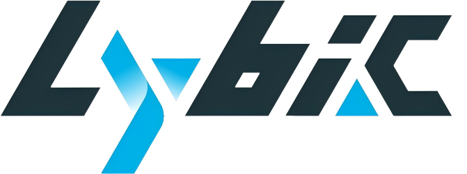

👋 **Hey there! Welcome to our GitHub repository!**

  

  <strong>Empowering AI Agents with advanced infrastructure and intelligence.</strong>

    <a href="https://lybic.ai/"><strong>Website</strong></a> ·
    <a href="https://github.com/lybic"><strong>GitHub</strong></a> ·
    <a href="https://x.com/Lybic_AI"><strong>Twitter</strong></a>

---

🚀 **Introduction and Mission**

Lybic provides a cutting-edge infrastructure solution for AI agents. Through our cloud-based sandbox environments (including virtual computers, mobile devices, and containers), we offer out-of-the-box GUI operation capabilities. This infrastructure, accessible via standard MCP, SDKs, and RESTful APIs, resolves critical challenges in GUI interaction, resource hosting, and high-concurrency execution.

Our self-developed **Grounding Inference Framework** empowers agents not just to "operate" interface elements, but to truly "understand" screen content, enabling autonomous decision-making in complex digital environments. Our mission is to provide the foundational tools that allow developers to focus on building intelligent agents, not on the underlying infrastructure.

---

✨ **Our Projects**

We are proud to host and develop several key open-source projects:

1. Lybic Agent

    An open-source, cross-platform AI assistant for Windows, macOS, and Linux. Built on the Lybic platform, this agent aims to seamlessly integrate intelligence into everyday desktop tasks.

2. Multi-Language SDKs

    To ensure easy integration with your existing projects, we provide SDKs for a variety of popular programming languages:
---

🤝 **How to Contribute**

We welcome contributions from the community! Whether you're a developer, a designer, or just an enthusiast, there are many ways to get involved:
- ⭐ **Star our repositories** to show your support.
- 🐞 **Report bugs** by opening an issue in the relevant project.
- 💡 **Suggest new features** or improvements.
- Pull requests are always welcome! Check out our project boards and open issues to see where you can help.

---

💻 **Technologies and Skills**

We primarily work with the following technologies:

  
  
  
  
  
  
   
  
  

---

📫 **Get in Touch**

Connect with us through any of the following channels:

  
  
  
  
  
  

---

  

